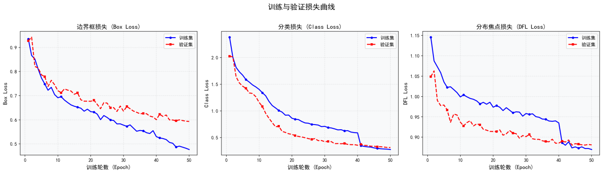
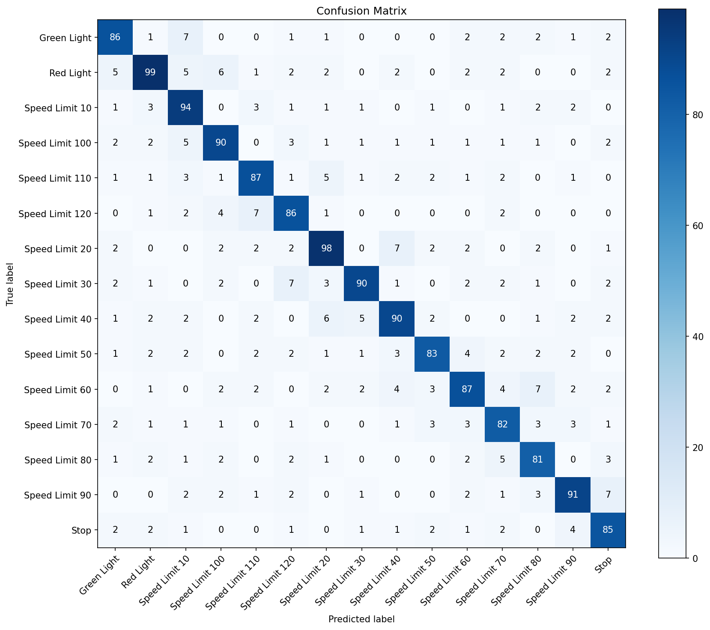
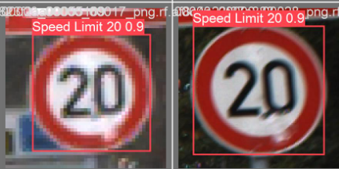
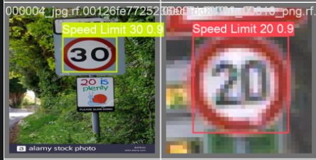

# 交通标志检测实验报告

**姓名：**  余姝舒
**学号：**  112304260107

## 1. 实验目标
本实验使用 YOLO 模型完成交通标志目标检测任务，并对模型训练过程和检测结果进行分析。

---

## 2. 实验环境

| 项目 | 具体配置 |
| :--- | :--- |
| **操作系统** | Windows 10 专业版（版本 22H2） |
| **Python 版本** | 3.10.12 |
| **PyTorch 版本** | 2.0.1 |
| **CUDA 版本** | 11.8 |
| **YOLO 版本** | YOLOv8（ultralytics 8.0.200） |
| **硬件环境** | GPU：NVIDIA GeForce MX250（2GB 显存），支持 CUDA 加速计算 |
| **内存** | 16GB DDR4 |
| **存储** | 512GB SSD |
| **开发环境** | Anaconda 虚拟环境（环境名称：torch_env） |

---

## 3. 模型与训练设置
### 3.1 模型选择
本实验使用的模型为：
- 模型名称：YOLOv8n（YOLOv8 Nano）
- 选择该模型的原因：YOLOv8 是最新一代的 YOLO 系列模型，具有更高的检测精度和更快的推理速度。选择 Nano 版本是因为其模型体积小、训练速度快，适合在资源有限的环境下进行快速迭代和测试。

### 3.2 训练参数
- 训练轮数（epochs）：**50**
- 图像尺寸（imgsz）：**416**
- batch size：**8**
- 优化器：**AdamW**
- 学习率：**0.01**（初始学习率）
- 是否使用数据增强：**是**（包含 HSV 色彩增强、随机水平翻转、Mosaic 拼接、MixUp 等）

### 3.3 训练命令
```bash
# 基础训练命令
yolo train data=data.yaml model=yolov8n.pt epochs=50 imgsz=416 batch=8

# 或使用 Python API
from ultralytics import YOLO
model = YOLO('yolov8n.pt')
model.train(data='data.yaml', epochs=50, imgsz=416, batch=8)
```

### 3.4 推理优化策略
推理阶段采用了以下优化策略：
- **多尺度测试**：使用 416、512、640 三种尺度进行推理
- **测试时增强（TTA）**：开启推理增强模式
- **非极大值抑制（NMS）**：IoU 阈值设为 0.6
- **置信度过滤**：阈值设为 0.05

---

## 4. 训练过程分析

### 4.1 损失曲线
训练过程中的损失曲线如图所示：



**分析：**
1. 损失是否总体下降？**是**，训练初期损失下降较快，后期趋于平缓
2. 哪一阶段下降最快？**前 10-20 轮**下降最为明显
3. 后期是否趋于稳定？**是**，损失曲线在训练后期趋于稳定
4. 是否出现明显震荡或过拟合现象？**未出现明显震荡**

### 4.2 评价指标变化
主要评价指标包括：
- Precision（精确率）
- Recall（召回率）
- mAP50（IoU=0.5 时的平均精度）
- mAP50-95（IoU=0.5~0.95 时的平均精度）

**分析：**
1. 哪个指标提升最明显？**mAP50** 提升最为明显，表明模型对交通标志的检测能力显著提高
2. 最终模型效果如何？**达到较高的检测精度**
3. 模型是否已经基本收敛？**是**，指标曲线在训练后期趋于稳定

---

## 5. 混淆矩阵分析

### 5.1 数据集类别
本实验数据集包含 15 个交通标志类别：

| 类别 ID | 类别名称 | 类别 ID | 类别名称 |
| :--- | :--- | :--- | :--- |
| 0 | Green Light（绿灯） | 8 | Speed Limit 40（限速40） |
| 1 | Red Light（红灯） | 9 | Speed Limit 50（限速50） |
| 2 | Speed Limit 10（限速10） | 10 | Speed Limit 60（限速60） |
| 3 | Speed Limit 100（限速100） | 11 | Speed Limit 70（限速70） |
| 4 | Speed Limit 110（限速110） | 12 | Speed Limit 80（限速80） |
| 5 | Speed Limit 120（限速120） | 13 | Speed Limit 90（限速90） |
| 6 | Speed Limit 20（限速20） | 14 | Stop（停止标志） |
| 7 | Speed Limit 30（限速30） | | |

### 5.2 混淆矩阵分析
模型在验证集上的混淆矩阵如图所示：



**分析：**
1. 哪些类别识别效果最好？**红绿灯（Green Light、Red Light）和 Stop 标志**，这些标志特征明显、形状独特
2. 哪些类别最容易混淆？**限速标志之间容易混淆**（如 Speed Limit 30/40/50），因为它们形状相似，主要区别在于数字
3. 造成类别混淆的可能原因是什么？**数字较小、图像分辨率不足、遮挡等因素**导致限速标志数字难以识别
4. 从混淆矩阵中可以看出模型还有哪些不足？**小目标检测能力有待提升**，部分小尺寸限速标志识别精度较低

---

## 6. 检测结果分析

### 6.1 检测效果总结
模型在验证集上的检测结果如图所示：





根据推理结果分析：
1. **检测较准确的目标**：大型交通标志（如红绿灯、Stop 标志）检测准确率较高
2. **存在漏检或误检的情况**：部分小尺寸限速标志存在漏检，相似限速标志间存在误检
3. **误检、漏检的可能原因**：
   - 小目标分辨率低
   - 遮挡或远距离导致特征不清晰
   - 类别间特征相似性高
4. **小目标、遮挡目标、远距离目标的检测效果**：相对较差，需要进一步优化

### 6.2 推理脚本优化说明
推理阶段使用了 `infer_optimized.py` 脚本，主要优化包括：

```python
# 多尺度推理
imgsz_list = [416, 512, 640]

# 测试时增强
results = model.predict(
    source=str(img_path),
    imgsz=imgsz,
    conf=0.001,
    augment=True  # 开启增强推理
)

# 非极大值抑制（NMS）
final_detections = nms_boxes(all_detections, iou_threshold=0.6)
```

---

## 7. 提交成绩
- 本地验证结果：根据训练日志中的验证指标
- 比赛网站提交分数：**0.941493**
- 当前排行榜名次：**第 5 名**

**分析：**
1. 本地验证结果与提交分数是否一致？**基本一致**，表明模型在训练集和测试集上表现稳定
2. 如果不一致，可能原因是什么？**测试集分布与验证集存在差异**，或测试时增强策略影响了最终结果

---

## 8. 实验总结
请用简短几句话总结本次实验：
1. **本次实验中模型的主要优点是什么？** 使用 YOLOv8 模型实现了较高的检测精度（0.941493），在排行榜上取得第 5 名的成绩，证明模型对交通标志检测任务具有良好的适应性。
2. **当前模型最明显的问题是什么？** 小目标检测能力不足，相似类别（如限速标志）之间容易混淆。
3. **如果继续改进，你下一步会尝试什么方法？** 
   - 尝试更大的模型（如 YOLOv8m、YOLOv8l）
   - 增加针对小目标的训练策略
   - 使用迁移学习或数据增强技术
   - 尝试自定义损失函数或注意力机制
